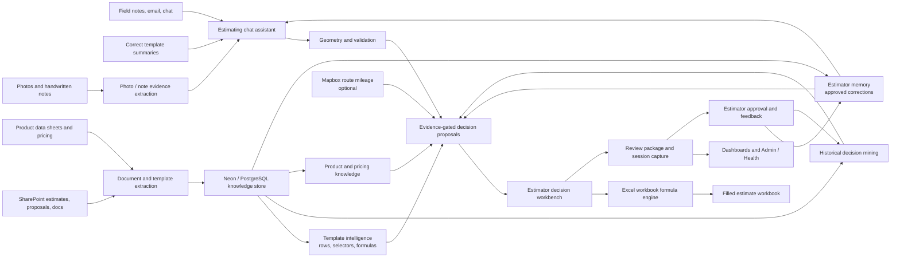

# Spray-Tec Estimating Assistant Architecture

This diagram shows the executive view of the estimating platform: inputs are converted into evidence-backed estimator decisions, Excel remains the calculation engine, and estimator corrections become reusable institutional knowledge.

## Executive Summary

- The assistant is not replacing the estimator; it helps turn notes, photos, history, pricing, and product guidance into reviewable workbook decisions.
- Excel estimating templates remain the trusted calculation engine for quantities, labor, costs, markups, and workbook outputs.
- Historical estimates and approved estimator corrections become reusable institutional knowledge.
- Product data and pricing are attached as evidence and guidance, not hidden overrides.
- Every estimate can produce a review package, final workbook, and learning data for future recommendations.

## Control Points

- Estimator review remains required before quoting.
- Memory candidates are pending until approved.
- AI decisions are evidence-gated and can be review-marked.
- Route mileage uses Mapbox only when configured and address evidence is available.
- Dashboards and Admin / Health expose review, memory approval, data quality, and operational status.
